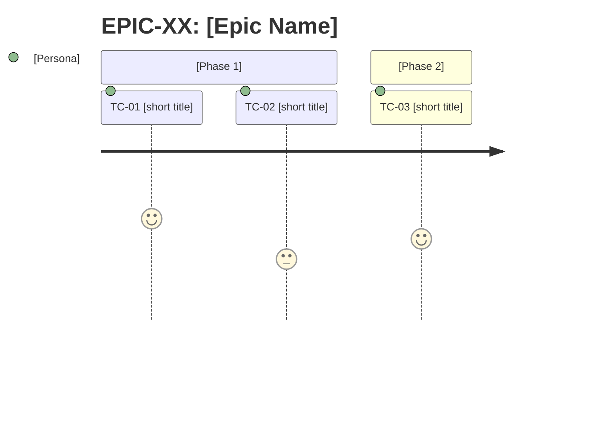

# SKILL: Planning

## Purpose
This skill defines the standards, templates, and quality rules for the Planner Agent to produce consistent, traceable backlogs ready for development.

---

## Canonical templates

### Epic
```markdown
## EPIC-XX: [Epic Name]

**Objective:** [One sentence: what business value this area delivers]
**Affected personas:** [E.g., BI Analyst, Administrator, End Customer]
**Success criterion:** [Observable metric or condition indicating the Epic is complete]
**External dependencies:** [Consumed external APIs, design system, third-party libraries]
**Priority:** High | Medium | Low
**Tasks:** [TC-XX, TC-YY, ...]
```

### Task Contract
````yaml
task_contract:
  id: TC-<NN>
  # Pattern: ^TC-[0-9]+$
  # Example: TC-01

  epic: EPIC-<NN>
  # Pattern: ^EPIC-[0-9]+$
  # Example: EPIC-03

  origin: <UC-NN | improve-NN | bug-NN | component-spec-gate | direct>
  # Enum: UC-NN | improve-NN | bug-NN | component-spec-gate | direct
  # Example: UC-04

  type: <feature | bugfix | refactoring | spec | tech_debt>
  # Enum: feature | bugfix | refactoring | spec | tech_debt

  priority: <P0 | P1 | P2>
  # Enum: P0 | P1 | P2

  scope: <frontend | backend>
  # Enum: frontend | backend
  # PROHIBITED: both

  estimate: <S | M>
  # Enum: S | M
  # PROHIBITED: L

  dependencies:
    - TC-<NN>
  # Array of TC-XX ids. Use [] if no dependencies.

  persona_coverage:
    - <persona-name>
  # Array of actors from spec.md §2 served by this task.
  # Example: [admin, end-user]

  bdd_ref: <FEAT-NN §9 | null>
  # Reference to BDD Scenarios section in the feature spec.
  # Use null if no BDD reference applies.

execution_contract:
  exec_type: <code_generation | bug_fix | refactoring | analysis | design | review | test_generation | validation | documentation>
  # Enum: code_generation | bug_fix | refactoring | analysis | design | review | test_generation | validation | documentation

  objective: <single objective sentence — what this task must accomplish>
  # One intention only. No narrative.

  input:
    references:
      - path: <relative path to artifact>
        section: <§N or section title>
        version: <semver or commit ref>
    # Array of structured references consumed by the executing agent.

    known_context:
      - <explicit known fact>
    # Array of facts already established — no inference required.

    assumptions_allowed:
      - <explicit permitted assumption>
    # Array of assumptions the agent is permitted to make.
    # Empty array = no assumptions allowed.

  constraints:
    - <explicit rule>
  # Array of hard constraints. One rule per item.

  output:
    format: yaml
    schema:
      - files_created
      - files_modified
      - acceptance_criteria_coverage
      - edge_cases
      - spec_divergences
      - tech_debt
      - tests
      - inference_log

  validation:
    criteria:
      - <objective verifiable criterion>
    # Each criterion must be independently verifiable.
    # No subjective criteria permitted.

  fallback:
    on_missing_input: blocked
    template: .claude/skills/u-shared-templates/blocked-report.yaml
````

> **scope field:** determines which domain orchestrator processes the task. For `domain: backend` projects, all tasks default to `backend`. For `domain: frontend`, all tasks default to `frontend`. For `domain: fullstack`, the Planner must explicitly set `backend` or `frontend` per task. Tasks with `scope: both` are prohibited — split into two linked task_contracts (see granularity rules).

---

## Task Contract Granularity Rules

| Signal | Action |
|---|---|
| estimate: L attempted | Prohibited — split into multiple TCs with estimate S or M |
| validation.criteria > 8 items | Likely 2 task_contracts |
| task covers > 2 screens or distinct flows | Split by screen or flow |
| scope: both attempted | Prohibited — split into TC backend + TC frontend with explicit dependency (frontend depends on backend) |
| dependencies in a cycle | Design error — resolve before delivering the backlog |
| backlog > 15 tasks | Deliver by Epic — do not process the entire file at once |

---

## Change scope rule (L4 — /u-improve only)

The activation prompt carries a `Change scope:` line. When it lists domains
(not `unrestricted`), those are the ONLY domains your Task Contracts may
target — the handoff manifest enumerates every on-disk domain, but untouched
domains are NOT in scope for this change.

| Signal | Action |
|---|---|
| `Change scope: unrestricted` | No restriction — plan freely (u-spec / greenfield) |
| A TC's spec inputs all live under `domains/<slug>/` outside the scope list | Prohibited — drop the TC or re-scope it. A deterministic gate (`check_backlog_scope.py`) rejects the whole backlog |
| Work in an out-of-scope domain looks genuinely necessary | Do NOT plan it — record it in the backlog notes as a follow-up recommendation; widening scope is triage's decision (`/u-improve` re-run), never the planner's |
| TC touches only front specs / infra / session-local files | Allowed — scope restricts domain-spec targets, not stack |

---

## Persona coverage gate

Before finalizing the backlog, verify:
- List all actors defined in spec.md §2 (or CLAUDE.md)
- For each actor: confirm that at least one TC with persona_coverage includes that actor
- If any actor has no coverage: create a TC or register as open question

| Actor | Covered by |
|---|---|
| {PersonaName} | TC-XX, TC-YY |

---

## Requirement coverage gate (Rec A)

Before finalizing the backlog, verify that **every requirement defined in the referenced specs maps to at least one Task Contract** — and cross-check against the original requirement text passed in the activation prompt (`Original requirement:`):
- Every `UC-NN` in a referenced `*.spec.md` is the `origin` of a TC, or is explicitly handled within another TC's scope.
- Every `FEAT-NN` in a referenced `*.feature.spec.md` is referenced by a TC's `bdd_ref`.
- A requirement intentionally left out of this wave is recorded explicitly in the backlog (e.g. an `## Out of scope` note), never silently dropped.

| Requirement | Covered by | Out-of-scope (reason) |
|---|---|---|
| {UC-NN / FEAT-NN} | TC-XX | — |

> Enforced deterministically by `check_spec_requirements_covered.py` at dev exit: an uncovered `UC`/`FEAT` blocks the dev→review transition. Do not rely on this prose alone — but producing an orphan requirement here is a backlog defect.

---

## Task contract — how to populate

Planner fills `execution_contract` YAML block for each Task Contract in Step 3B before saving `backlog.md`. This is the Orchestrator's primary context-mounting source — replaces ad hoc inference at Developer activation.

### exec_type

| Task Type | exec_type |
|---|---|
| feature | `code_generation` |
| improve | `code_generation` |
| bugfix | `bug_fix` |
| refactoring | `refactoring` |
| spec | `documentation` |
| tech_debt | `refactoring` |

### objective

Single operational sentence describing what the agent must produce. Not a business narrative. Example: `"Implement POST /auth/login endpoint with JWT emission and BR-01 credential validation."`

### input.references — spec-first mode

Each reference must include `version` — the spec version at Planner time. This pins the spec consumed for traceability from backlog → delivery → audit.

**Backend:**
```yaml
references:
  - path: "{SPECS_DIR}/domains/{domain}/openapi.yaml"
    section: "paths: POST /resource, GET /resource/{id}"
    version: "1.0.0"
  - path: "{SPECS_DIR}/domains/{domain}/back/{domain}.back.md"
    section: "BRs: BR-01, BR-02; EVs: EV-01; tables: users"
    version: "1.0.0"
  - path: "{SPECS_DIR}/_global/error-codes.md"
    section: "codes: AUTH_001, RESOURCE_NOT_FOUND"
    version: "1.0.0"
```

**Frontend:**
```yaml
references:
  - path: "{SPECS_DIR}/front/features/{feature}.feature.spec.md"
    section: "§1 endpoints, §4 transforms, §7 adapters, §9 BDD"
    version: "1.0.0"
  - path: "{SPECS_DIR}/domains/{domain}/openapi.yaml"
    section: "consumed: operationId1, operationId2"
    version: "1.0.0"
  - path: "{SPECS_DIR}/front/components/{Name}.component.spec.md"
    section: "§2 Props, §3 States, §4 Events"
    version: "1.0.0"
  - path: "{SPECS_DIR}/_global/error-codes.md"
    section: "codes: UI_ERR_001"
    version: "1.0.0"
```

> **Version source:** read from the `version:` field in each spec file's frontmatter or YAML header. If absent, use git short hash at planning time, or `"unknown"` as fallback — never omit the field.

> No `{SPECS_DIR}` (Improve mode without approved specs): set `references: [{path: codebase, section: "Developer discovers via inspection"}]`

### input.known_context

Pre-loaded facts that do not require file reads. Reduces unnecessary discovery steps.
Example: `["UserService extends BaseService in src/shared — do not duplicate", "JWT issued via injected JwtService"]`

### input.assumptions_allowed

Explicit list of inference types the Developer may use without declaring in `inference_log`.
Example: `["reuse existing repository patterns", "follow established route naming conventions"]`
Inferences NOT listed here must be recorded in `inference_log` in the delivery.

### constraints

Task-specific rules beyond `CLAUDE.md`. Primary use: cross-task contract preservation.
Example: `["preserve GET /users response schema — also consumed by TC-03"]`
Empty list when no constraints apply.

### output.schema

Fixed for most tasks — matches `delivery-body` YAML fields in the delivery template.
Override only for `exec_type: documentation` (Spec tasks) which produce `.spec.md` artifacts.

### validation.criteria

Technical criteria the Developer self-validates before setting `qa_ready: true`.
Example: `["all tests pass locally", "no hardcoded values — only design tokens via var(--token)", "no endpoint fields outside openapi.yaml contract"]`

### fallback

Always: `on_missing_input: blocked` + `template: .claude/skills/u-shared-templates/blocked-report.yaml`
Never leave empty — if all inputs available, still declare the fallback.

---

## Numbering convention

```
EPIC-01, EPIC-02, ...
TC-01, TC-02, ...   <- global numbering, not per Epic
```

Task Contracts are numbered sequentially across the entire project — makes cross-referencing easier.

---

## Dependency map

At the end of `backlog.md`, always include:

```markdown
## Dependency map

TC-01 -> (none)
TC-02 -> TC-01
TC-03 -> TC-01
TC-04 -> TC-02, TC-03
```

Use `->` to indicate "depends on". If there is a cycle, it is a design error — resolve it before delivering the backlog.

---

## Backlog quality checklist

Before saving `backlog.md`, validate:

- [ ] Every TC has persona_coverage with at least 1 persona
- [ ] Every TC has bdd_ref declared (FEAT-NN §9 or null)
- [ ] No TC has estimate L — prohibited without splitting into S or M
- [ ] All dependencies are explicit in the map
- [ ] There are no dependency cycles
- [ ] Open questions are marked with `Warning`
- [ ] Personas used in task_contracts are defined in `CLAUDE.md` or the project context
- [ ] Task Contract order in the backlog respects dependencies (tasks without dependencies first)
- [ ] Every TC has execution_contract populated: exec_type defined, objective written, input.references declared (spec-first) or marked as codebase, validation.criteria non-empty for code_generation/bug_fix types

---

## Personas — how to define

If the project does not have defined personas, the Planner must list them before creating Task Contracts:

```markdown
## Project personas

- **[Name]:** [Who they are, what they do, their primary goal in the system]
- **[Name]:** [...]
```

Generic personas like "user" or "admin" are allowed only if the system truly does not distinguish profiles.

---

## Customization via CLAUDE.md

The project's `CLAUDE.md` can (and should) override parts of this skill. When reading `CLAUDE.md`, extract:

| What to look for | Used in |
|---|---|
| Defined personas or user profiles | Task Contract persona_coverage |
| Business domain and specific terminology | validation.criteria language |
| Technical constraints (e.g., component framework, design system, router routes) | constraints and known_context |
| Existing components or pages | Dependencies and known_context |

If `CLAUDE.md` does not define personas, the Planner must create them in the backlog before writing any Task Contract.

---

## Final backlog.md structure

```markdown
# Backlog

_Created on: YYYY-MM-DD_
_Last updated: YYYY-MM-DD_
**Layer:** semi-permanent

---

## Personas
[persona list]

---

## Epics
[list of epics using the canonical template]

---

## Task Contract overview

| ID | Title | Persona | Priority | Epic | Status |
|----|-------|---------|----------|------|--------|
| TC-01 | [title] | [persona] | P0 | EPIC-01 | Backlog |
| TC-02 | [title] | [persona] | P1 | EPIC-01 | Backlog |

---

## Task Contracts by priority

### P0 — Must Have
> Without these Task Contracts the product does not work or lacks minimum value.

[P0 task contracts grouped by epic, in dependency order]

### P1 — Should Have
> Important for the experience, but do not block launch.

[P1 task contracts grouped by epic, in dependency order]

### P2 — Nice to Have
> Desirable when capacity allows — do not compromise the current cycle if deferred.

[P2 task contracts grouped by epic, in dependency order]

---

## Dependency map
[text graph]

---

## Journey maps by Epic

> Include for each Epic with 3 or more Task Contracts in mandatory sequence.
> Optional for Epics with parallel or independent Task Contracts.



---

## Open questions
[list of items marked with Warning that need answers before development]
```
